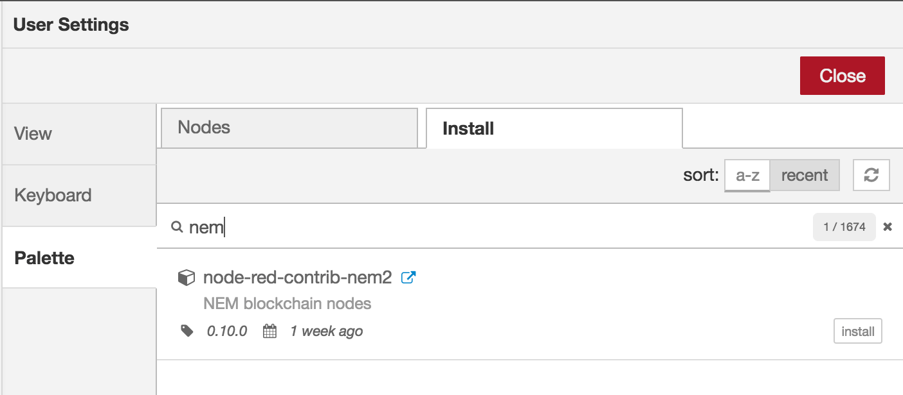
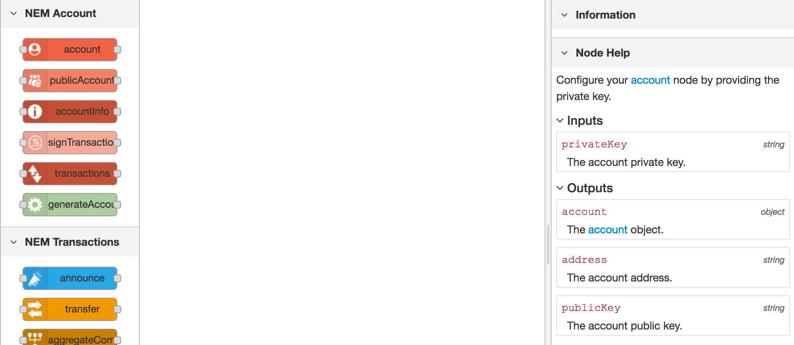
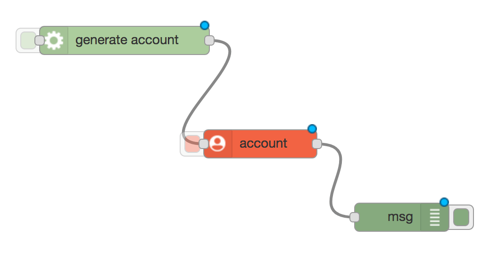
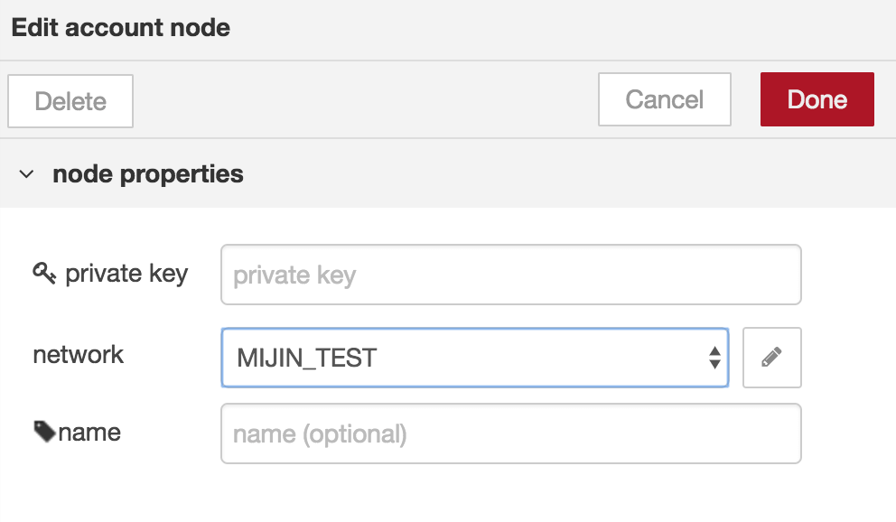
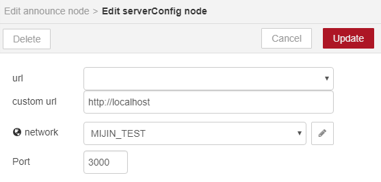
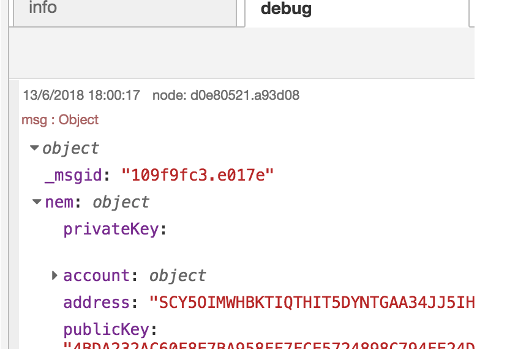

# nem2 prototyping tool

:warning: This repo is archived because it is no longer being maintained. If you are interested in maintaining it, contact us via Slack #sig-client.

:information_source: The prototyping tool is only compatible with catapult-server 0.1.

Create blockchain applications without coding using **NEM2 Prototyping Tool**.

Drag & drop NEM nodes and link them with other services in new and interesting ways for prototyping or learning purposes.

## Node-RED

The nem2-prototyping-tool is a collection of **Node-RED** nodes. [Node-RED] is a visual programming tool to wire together hardware devices, APIs and online services. It provides a browser-based editor to wire nodes. The combination of nodes is named flows, which you can execute in a single click. 

The flows created in Node-RED are stored using JSON, being exportable to share with others.

## Requirements

* Node-RED 0.18.4.

* Node.js 8.

## Installation

Download and run the [executable-package](https://github.com/nemtech/nem2-prototyping-tool/releases/tag/v0.10.0) for **Windows**, **Linux** or **Mac**.

Do you already have Node-RED app? Open ``Manage palette`` and install ``node-red-contrib-nem2`` package.

``*Manage palette -> Install -> node-red-contrib-nem2*``

### For Developers

1. Install Node-RED:

``npm install -g node-red``

2. Clone this repository:

`git clone https://github.com/nemtech/nem2-prototyping-tool.git`

3. Install required packages using npm:

``npm install``

4. Create a symbolic link:

`npm link`

``cd ~/.node-red/``

``npm link /path/to/cloned-repository/``

5. Run Node-RED:

``node-red``

## Usage

### Getting started

The left sidebar is the **node palette**. You can find NEM2 related nodes under:

* NEM2 Account
* NEM2 Transactions
* NEM2 Listeners
* NEM2 Utility

1. Open the *NEM account* tab and click once on the **account** node.

The right sidebar shows you the node description, properties, input fields and returned outputs.

You have to link nodes together, connecting the previous node outputs with the following node inputs.

In some cases, you could configure inputs and properties directly by double-clicking a node.

2. Link the account node with others. As we need a ``privateKey`` as an input, we could opt to drag and drop and link **generateAccount** with **account** node, under *NEM Account*.

 
3. Double-click on account node. Choose the ``network`` you want to use. Do the same for generateAccount node.

:information_source: Have you seen  ``private key`` under account node properties?  Setting a property hardcoded overwrites the input. In other words, when not empty, this property will be used instead of ``privateKey`` output provided by **generateAccount** node.

4. Open the *output* tab and click once on the **debug** node. 

5. Link it with the account, and change  ``output``  property to ``complete msg object``.

### Configuring an API gateway

Some nodes require to configure an API gateway (e.g. **announce transaction** and **listener** nodes).

1. Double-click on a node which needs this configuration.

2. Click on the pencil icon next to the ``Server`` input field.

3. Enter your ``custom url`` using http or https schema (e.g. http://localhost). Choose the ``network`` and ``port`` you want to use and then press ``Update``.

### Running a flow

1. Click on the ``deploy`` button, at the top-right corner of your screen.

2. Select the square attached to the first node to run the flow.

3. Check the output returned at the right sidebar, under the debug tab. NEM2 nodes return outputs following the structure ``msg.nem(name_of_the_output)``.

## Importing a flow

1. In Node-RED, select ``Import -> Clipboard from the menu`` (Ctrl-E).

2. Paste the JSON flow and click ``Import`` button.

### Exporting a flow

1. In Node-RED, select the flow you want to export.

2. Open ``Export -> Clipboard`` from the menu (Ctrl-E) and copy the JSON from the dialogue.

## Examples

### Basics

* [Create a transfer transaction](https://flows.nodered.org/flow/7061090eb3cbf724c80e4f49e03e1b94)
* [Create namespace](https://flows.nodered.org/flow/3d87669bfc71e99f29f5ad82ba2a402e)
* [Create mosaic](https://flows.nodered.org/flow/04a643b66a8e0daa1e12fa61e3b36b7c)
* [Create multisig account](https://flows.nodered.org/flow/ba75b67684b2a1bc2af849cc70a7c4b5)
* [Create aggregate transaction](https://flows.nodered.org/flow/50aa98fd20e62ee1af8507df8634f840)
* [Cosign aggregate transaction](https://flows.nodered.org/flow/522d512fb0b5e0ad16a65a8c909fd95a)

## Applications

* [Simple chat](https://flows.nodered.org/flow/e8bfbab9d73e0f35ed6b4c9a9f7e4958)

## Contributing

This project is developed and maintained by NEM Foundation.
Contributions are welcome and appreciated.
You can find [nem2-prototyping-tool on GitHub][self];
Feel free to start an issue or create a pull request. Check [CONTRIBUTING](CONTRIBUTING.md) before start.

## Getting help

- [NEM2 Documentation][docs]
- Join the community [slack group (#sig-client)][slack] 
- If you found a bug, [open a new issue][issues]

## License

Copyright (c) 2018-present NEM
Licensed under the [Apache License 2.0](LICENSE)

[self]: https://github.com/nemtech/nem2-prototyping-tool
[issues]: https://github.com/nemtech/nem2-prototyping-tool/issues
[Node-RED]: https://nodered.org/
[slack]: https://join.slack.com/t/nem2/shared_invite/enQtMzY4MDc2NTg0ODgyLWZmZWRiMjViYTVhZjEzOTA0MzUyMTA1NTA5OWQ0MWUzNTA4NjM5OTJhOGViOTBhNjkxYWVhMWRiZDRkOTE0YmU
[docs]: https://nemtech.github.io/
